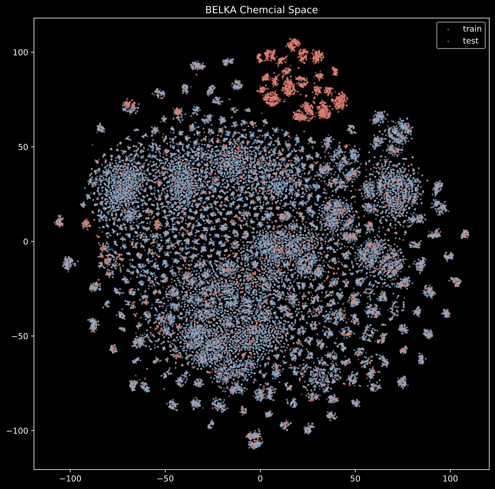
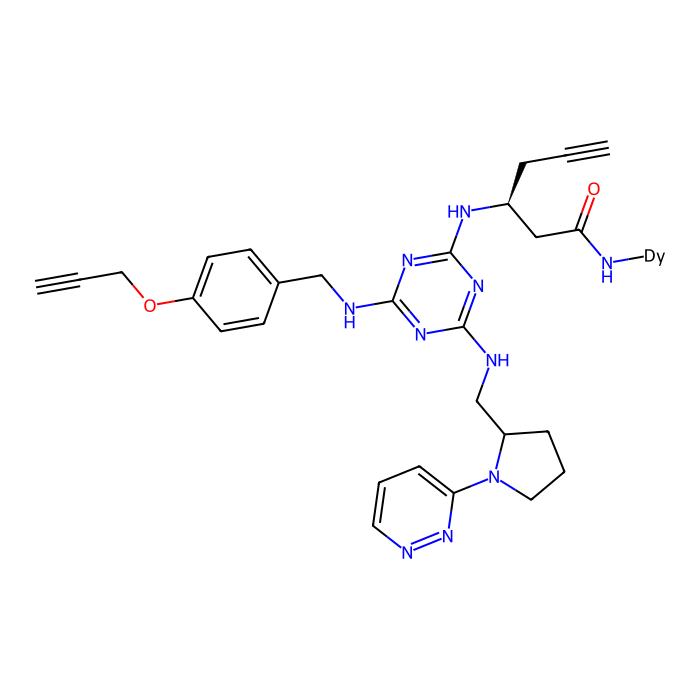
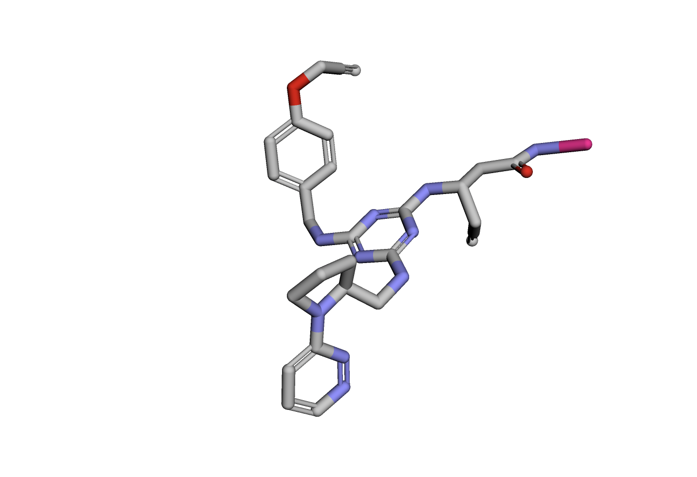
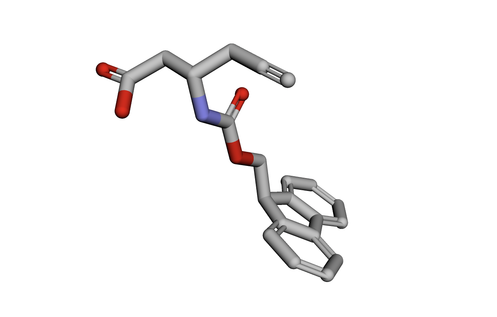
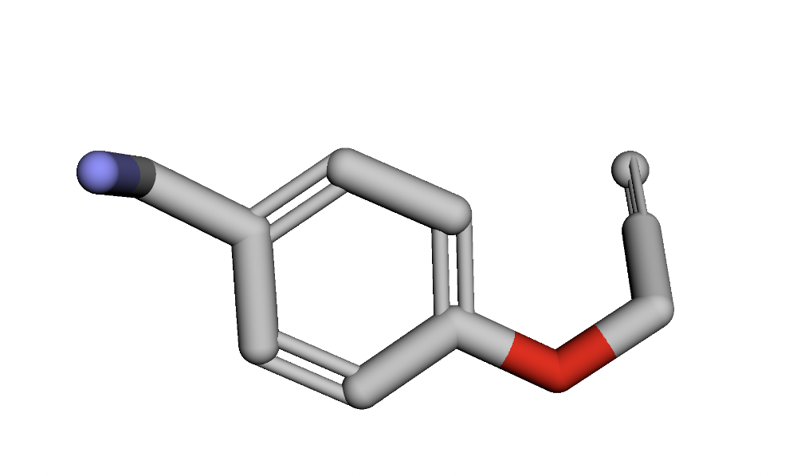
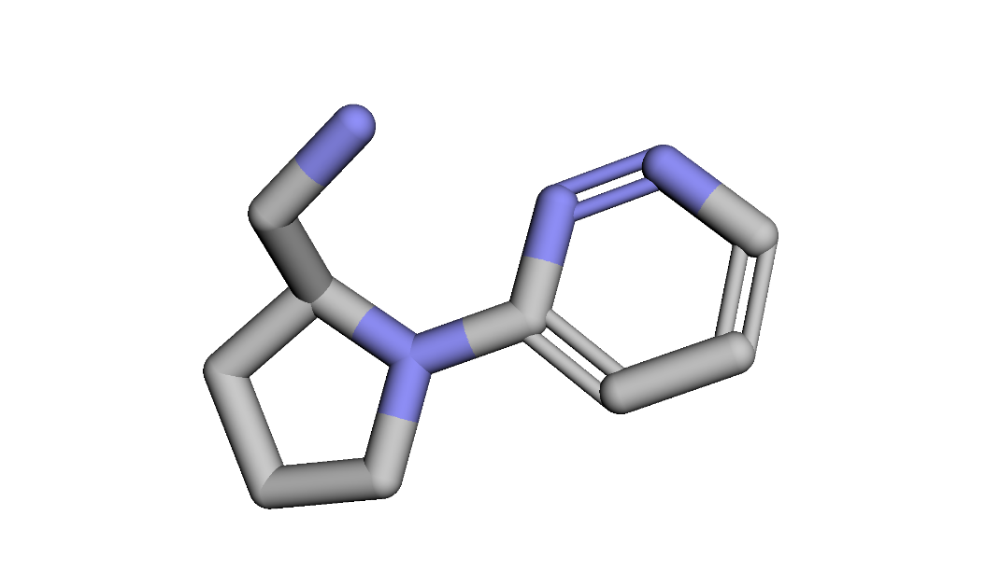
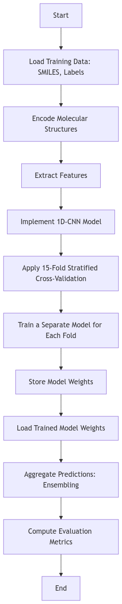

# **LigandNet**: Small Molecule-Protein Interactions Prediction Model 

**Abstract**: *This code is the solution of the [NeurIPS 2024 - Predict New Medicines with BELKA](https://www.kaggle.com/competitions/leash-BELKA/overview) which ranked 73rd out of 1950 teams*. 

The code implements a deep learning approach to predict small molecule-protein interactions using the BELKA dataset. The model is based on a 1D Convolutional Neural Network (1D-CNN) trained on SMILES representations of molecules to classify their binding affinity to protein targets. The dataset consists of molecular structures and their corresponding binary binding labels, obtained through DNA-encoded chemical library (DEL) technology.

To enhance model performance, the code employs a 15-fold stratified cross-validation strategy, training separate models for each fold and storing their weights to facilitate ensembling. The preprocessing pipeline includes encoding SMILES data, feature extraction, and augmenting the dataset with additional molecular descriptors. The final predictions are generated by aggregating outputs from multiple folds, achieving an **average precision score of 0.26109**.

## Plots

#### t-SNE Plot of Dataset

#### Visualizing (1st) molecule and building block
- 2d
  

- 3d

  - Molecule_Smiles
    
  

  1. Building block_1
     
  

  2. Building block_2
     
  

  3. Building block_3
     
  

## Flow Chart

  

## References

- https://www.kaggle.com/code/ahsuna123/anusha-s-research-book-3d-visualization
- https://www.kaggle.com/code/ahmedelfazouan/belka-1dcnn-starter-with-all-data
- https://www.kaggle.com/datasets/hugowjd/1dcnn-models-for-belka-competition
- https://www.kaggle.com/datasets/ahmedelfazouan/belka-enc-dataset
